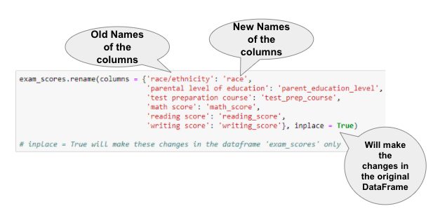
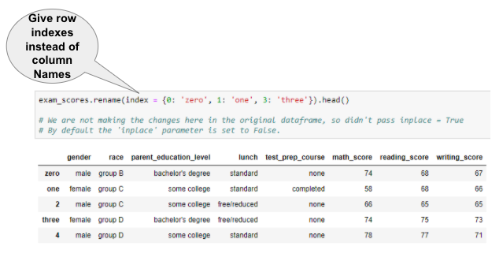
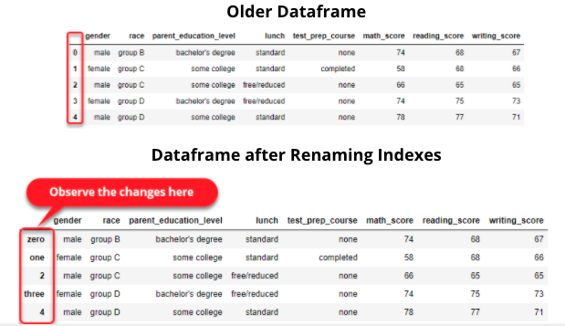

# Renaming

* Renaming means changing the name. 
* Most of the time we get dataset where column names are not satisfactory.  
* For example in this dataset the 'math score', 'reading score' and 'writing score' contains spaces in it due to which we are not able to use attribute\(dot\) selection style method to select a particular column.  
* And not only this if the column names were 'ms' for math score, 'rs' for reading score and 'ws' for writing score, these are not satisfactory column names. The need of renaming a column or index comes here. 
* Pandas provides a function ‘rename\(\)’ to rename column/indexes in a dataframe. 
* Let's rename all the column names in our dataframe which contains spaces in it. Also we will rename the column 'race/ethnicity' to 'race'.

* We can get the list of all the columns using an attribute columns.

* We can also rename the indexes of the dataframe using the rename\(\) function as shown in the image below.

